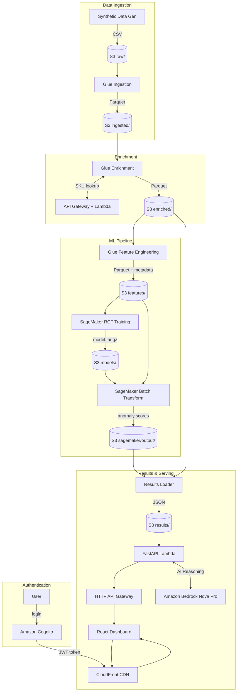
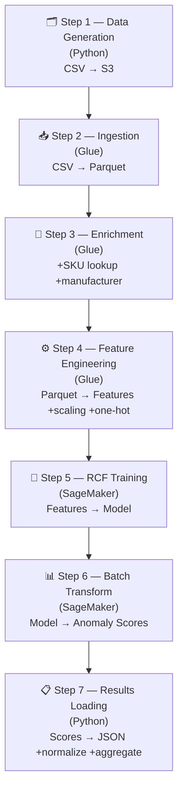
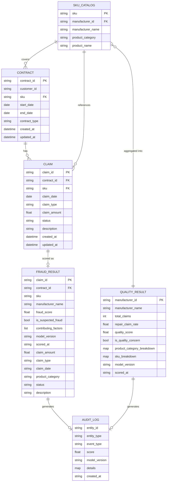
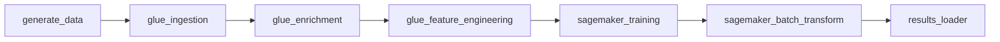

# Fraud Detection & Manufacturer Quality Analysis

An AWS-native pipeline that detects anomalous warranty claims and flags manufacturer quality concerns using unsupervised machine learning. Built on Amazon SageMaker Random Cut Forest (RCF), AWS Glue, Lambda, API Gateway, and CloudFront. The dashboard uses Amazon Bedrock Nova Pro to generate on-demand AI reasoning for flagged claims and manufacturers, giving analysts natural-language explanations alongside the statistical scores.

## How It Works

This pipeline finds suspicious warranty claims and flags manufacturers with quality problems — automatically, without anyone defining what "fraud" looks like.

### The Algorithm

The [Random Cut Forest](https://docs.aws.amazon.com/sagemaker/latest/dg/randomcutforest.html) (RCF) algorithm learns what a "normal" claim looks like by studying millions of them. It randomly slices the data space into regions — normal claims cluster together in dense groups, while unusual claims sit alone in sparse corners. The more isolated a claim is, the higher its anomaly score. Scores are scaled to 0–1, and anything above 0.7 is flagged as suspected fraud.

### The Features

Each claim is described by 12 numbers. There are two types:

- **Continuous** — Measurements like dollar amounts or days, standardized so they're comparable (0 = average, 2 = twice as far from average as most)
- **One-hot** — Yes/no flags for categories like claim type or product type (1 = yes, 0 = no)

| Feature | Type | What it captures |
|---------|------|-----------------|
| `claim_amount` | continuous | Dollar amount. A $15k claim when the average is $500 stands out immediately. |
| `days_between_contract_start_and_claim` | continuous | How fast the claim was filed. A claim 2 weeks after purchase is more suspicious than one at 18 months. |
| `manufacturer_claim_frequency` | continuous | Total claims for this manufacturer. 500 claims when peers average 50 is a red flag. |
| `claim_type_repair` | one-hot | Repair claim? Manufacturers with disproportionate repairs signal quality issues. |
| `claim_type_replacement` | one-hot | Replacement claim? |
| `claim_type_refund` | one-hot | Refund claim? |
| `claim_type_unknown` | one-hot | Missing claim type? Missing data can itself be a signal. |
| `product_category_electronics` | one-hot | Electronics product? |
| `product_category_appliances` | one-hot | Appliance? |
| `product_category_automotive` | one-hot | Automotive product? |
| `product_category_furniture` | one-hot | Furniture? |
| `product_category_unknown` | one-hot | Missing category? |

### How Features Catch Fraud

**Continuous features** measure magnitude — how extreme a claim is compared to normal:
- A $15k `claim_amount` when the average is $500 places the claim far from the cluster. The standardized value might be 5+ (meaning 5x further from average than most claims).
- A `days_between_contract_start_and_claim` of 14 days when most claims come at 18 months flags suspiciously fast filing.
- A `manufacturer_claim_frequency` of 500 when peers average 50 means every claim from that manufacturer already starts in unusual territory.

**One-hot features** capture categorical patterns — what kind of claim this is:
- `claim_type_repair` = 1 combined with a high dollar amount is a different signal than a replacement or refund at the same amount. Repairs are the most common type in fraudulent patterns.
- `product_category_furniture` = 1 with a $10k amount is far more unusual than `product_category_automotive` = 1 at the same amount. The encoding lets the algorithm learn different "normal" ranges per category.

The power is in the combination. A single unusual feature might not trigger a flag. But a claim that's high-dollar AND filed quickly AND a repair AND from a high-frequency manufacturer sits in a region of the data space where almost no legitimate claims exist. RCF detects this isolation and assigns a high anomaly score. The top 3 features with the largest deviation from normal are reported as contributing factors.

### How Features Catch Quality Issues

Separately from fraud, the pipeline aggregates claims by manufacturer and computes each one's repair rate (repairs ÷ total claims). If a manufacturer's repair rate is more than 2 standard deviations above the mean, they're flagged as a quality concern. This catches manufacturers whose products break far more often than peers. Results include per-SKU breakdowns so analysts can pinpoint which products are driving the problem.

### AI Reasoning

On the dashboard, analysts can request a plain-English explanation for any flagged claim or manufacturer, powered by Amazon Bedrock Nova Pro. The AI reviews the statistical scores, contributing factors, and context to generate a narrative assessment.

### Synthetic Data

The data generator creates realistic test data with three manufacturer tiers:

| Tier | % of Manufacturers | Behavior |
|------|-------------------|----------|
| Problem | ~10% | Receive all anomalous claims (high amounts, repair bursts, rapid claims) |
| Good Quality | ~50% | Very low repair rates (~5%), lower claim amounts, mostly replacement/refund |
| Neutral | ~40% | Normal mix of claim types and amounts |

Claims are split 50/50 between normal and anomalous patterns using four anomaly types: `high_amount` ($5k–$25k), `rapid_claim` (filed within 6 months), `repair_burst` (always repair type), and `combo` (high amount + repair).

## Architecture



## Pipeline Flow



## Data Model



The pipeline processes three raw input tables (Contract, Claim, SKU Catalog) and produces three output tables (Fraud Result, Quality Result, Audit Log):

| Entity | Storage | Description |
|--------|---------|-------------|
| Contract | `raw/contracts.csv` → `ingested/contracts/` | Warranty contracts linking customers to SKUs |
| Claim | `raw/claims.csv` → `ingested/claims/` → `enriched/claims/` | Warranty claims filed against contracts, enriched with manufacturer data |
| SKU Catalog | `raw/sku_catalog.csv` | Product catalog mapping SKUs to manufacturers and categories |
| Fraud Result | `results/fraud_results.json` | Per-claim anomaly scores with contributing factors |
| Quality Result | `results/quality_results.json` | Per-manufacturer quality scores with category and SKU breakdowns |
| Audit Log | `results/audit_log.json` | Audit trail of all fraud flags and quality flags |

### Sample Data

**Contract** — a warranty contract linking a customer to a product SKU:
```json
{
  "contract_id": "CONTRACT-000000001",
  "customer_id": "CUST-000004721",
  "sku": "SKU-00042",
  "start_date": "2023-06-15",
  "end_date": "2025-06-15",
  "contract_type": "extended"
}
```

**Claim** — a warranty claim filed against a contract:
```json
{
  "claim_id": "CLAIM-000000001",
  "contract_id": "CONTRACT-000000001",
  "sku": "SKU-00042",
  "claim_date": "2024-01-10",
  "claim_type": "repair",
  "claim_amount": 12450.00,
  "status": "open",
  "description": "Component failure after normal use"
}
```

**SKU Catalog** — maps SKUs to manufacturers and product categories:
```json
{
  "sku": "SKU-00042",
  "manufacturer_id": "MFR-00003",
  "manufacturer_name": "Manufacturer_3",
  "product_category": "electronics",
  "product_name": "Laptop"
}
```

**Fraud Result** — per-claim anomaly score produced by the pipeline:
```json
{
  "claim_id": "CLAIM-000000001",
  "contract_id": "CONTRACT-000000001",
  "sku": "SKU-00042",
  "manufacturer_name": "Manufacturer_3",
  "fraud_score": 0.92,
  "is_suspected_fraud": true,
  "contributing_factors": ["claim_amount", "manufacturer_claim_frequency", "claim_type_repair"],
  "claim_amount": 12450.00,
  "claim_type": "repair",
  "product_category": "electronics"
}
```

**Quality Result** — per-manufacturer quality assessment with SKU breakdown:
```json
{
  "manufacturer_id": "MFR-00003",
  "manufacturer_name": "Manufacturer_3",
  "total_claims": 320,
  "repair_claim_rate": 0.48,
  "quality_score": 3.1,
  "is_quality_concern": true,
  "product_category_breakdown": {
    "electronics": { "category": "electronics", "claim_count": 200, "repair_rate": 0.55 }
  },
  "sku_breakdown": {
    "SKU-00042": { "sku": "SKU-00042", "claim_count": 85, "repair_count": 52, "repair_rate": 0.61 }
  }
}
```

**Audit Log** — trail entry for a flagged claim:
```json
{
  "event_type": "fraud_flag",
  "entity_type": "claim",
  "entity_id": "CLAIM-000000001",
  "score": 0.92,
  "model_version": "models/20240110-120000/model.tar.gz",
  "details": { "contributing_factors": ["claim_amount", "manufacturer_claim_frequency"], "threshold": 0.7 },
  "created_at": "2024-01-10T12:10:00Z"
}
```

## Project Structure

```
.
├── api/                          # FastAPI backend (deployed as Lambda)
│   ├── main.py                   #   App entry point + Mangum handler
│   ├── data_store.py             #   S3-backed in-memory data store
│   └── routes/                   #   /fraud, /quality, /audit endpoints
├── dashboard/                    # React + TypeScript frontend
│   └── src/
│       ├── pages/                #   FraudOverview, FraudDetail, QualityOverview, QualityDetail
│       ├── components/           #   Filters, Pagination, ExportButton, AuditTrail
│       └── api/client.ts         #   Axios API client
├── glue/                         # AWS Glue ETL jobs (PySpark)
│   ├── ingestion_job.py          #   CSV → Parquet conversion
│   ├── enrichment_job.py         #   SKU lookup + manufacturer join
│   └── feature_engineering_job.py#   Feature matrix for RCF
├── lambda/
│   └── sku_lookup/handler.py     # SKU microservice (API Gateway + Lambda)
├── pipeline/                     # SageMaker orchestration modules
│   ├── sagemaker_training.py     #   RCF model training
│   ├── sagemaker_batch_transform.py # Batch scoring
│   └── results_loader.py        #   Parse scores → JSON results
├── scripts/
│   └── generate_data.py          # Synthetic data generator
├── infra/                        # AWS CDK infrastructure
│   ├── app.py                    #   CDK app entry point
│   └── stack.py                  #   Full stack definition
├── tests/
│   ├── unit/                     #   Unit tests (pytest)
│   └── property/                 #   Property-based tests (hypothesis)
├── config.py                     # Shared pipeline configuration
├── run_pipeline.py               # Pipeline orchestrator CLI
└── launch_app.sh                  # End-to-end run script (calls AWS services)
```

## Prerequisites

- Python 3.11+
- Node.js 18+ (for dashboard)
- AWS CLI configured with appropriate credentials
- AWS CDK CLI (`npm install -g aws-cdk`)

## Setup

```bash
# Create and activate virtual environment
python -m venv .venv
source .venv/bin/activate

# Install dependencies
pip install -r requirements.txt
pip install -r requirements-dev.txt
pip install -r infra/requirements.txt

# Install dashboard dependencies
cd dashboard && npm install && cd ..
```

## Deploy Infrastructure

```bash
# Build the dashboard first
cd dashboard && npm run build && cd ..

# Deploy the CDK stack
cdk deploy --app "PYTHONPATH=. .venv/bin/python infra/app.py"
```

The API Lambda is bundled with its pip dependencies (`fastapi`, `mangum`) using CDK's local bundling — no Docker required. The `pip install` uses `--platform manylinux2014_x86_64` flags to download Linux-compatible wheels even when building on macOS.

The stack creates:
- S3 data bucket
- SKU Lookup Lambda + REST API Gateway
- 3 Glue jobs (ingestion, enrichment, feature engineering)
- SageMaker IAM role
- FastAPI Lambda + HTTP API Gateway
- Dashboard S3 bucket + CloudFront distribution

Stack outputs:
| Output | Description |
|--------|-------------|
| `DataBucketName` | S3 bucket for all pipeline data |
| `SkuApiUrl` | SKU microservice endpoint |
| `HttpApiUrl` | FastAPI backend endpoint |
| `SageMakerRoleArn` | IAM role for SageMaker jobs |
| `DashboardUrl` | CloudFront URL for the React dashboard |
| `CognitoUserPoolId` | Cognito User Pool ID (for auth configuration) |
| `CognitoAppClientId` | Cognito App Client ID (for auth configuration) |
| `CognitoDomain` | Cognito Hosted UI domain URL |

### Cognito Authentication (optional)

The stack includes a Cognito User Pool to protect the dashboard. After deploying, create a demo user:

```bash
bash launch_app.sh --create-user YourPassword1
```

This creates (or resets) `demo@example.com` with the password you provide. The password must meet the Cognito policy: 8+ characters, uppercase, lowercase, and digits.

Auth is optional — if the `VITE_COGNITO_*` env vars aren't set, the dashboard works without authentication.

## Running the Pipeline

### Full end-to-end (recommended)

```bash
bash launch_app.sh            # runs all steps (default)
bash launch_app.sh --all      # runs all steps (explicit)
```

The script automatically fetches stack outputs and runs all steps sequentially:
1. Generates synthetic contracts, claims, and SKU catalog → uploads CSV to S3
2. Runs Glue ingestion job (CSV → Parquet)
3. Runs Glue enrichment job (SKU lookup + manufacturer join)
4. Runs Glue feature engineering job (numerical feature matrix)
5. Trains SageMaker RCF model
6. Runs SageMaker batch transform (anomaly scoring)
7. Parses scores, normalizes, aggregates, writes JSON results to S3

### Running individual steps

You can run any combination of steps independently:

```bash
bash launch_app.sh --datagen              # Step 1 only: generate synthetic data
bash launch_app.sh --glue                 # Step 2 only: run all Glue jobs
bash launch_app.sh --training             # Step 3 only: SageMaker RCF training
bash launch_app.sh --transform            # Step 4 only: SageMaker batch transform
bash launch_app.sh --results              # Step 5 only: load results to S3
bash launch_app.sh --training --transform # combine multiple steps
bash launch_app.sh --transform --model-artifact s3://bucket/models/.../model.tar.gz
bash launch_app.sh --local-ui             # start dashboard dev server locally
bash launch_app.sh --results --local-ui   # load results then launch dashboard
bash launch_app.sh --create-user MyP@ss1   # create/reset demo Cognito user
bash launch_app.sh -h                     # show help
```

| Flag | Step | Description |
|------|------|-------------|
| `--all` | 1-5 | Run all steps (default when no flags given) |
| `--datagen` | 1 | Generate synthetic data and upload to S3 |
| `--glue` | 2 | Run ingestion, enrichment, and feature engineering Glue jobs |
| `--training` | 3 | Train SageMaker RCF model |
| `--transform` | 4 | Run SageMaker batch transform (scoring) |
| `--results` | 5 | Parse scores, normalize, aggregate, write JSON to S3 |
| `--local-ui` | — | Start the dashboard Vite dev server locally (proxies to deployed API) |
| `--create-user PASS` | — | Create/reset the demo Cognito user (`demo@example.com`) with the given password |
| `--model-artifact PATH` | — | Provide model artifact path for `--transform` without `--training` |

### Smart skip and how to bypass it

When running `--all` (or no flags), the script checks S3 for existing artifacts and skips training/transform if they already exist. This saves time on repeat runs when the model and scores haven't changed.

To force a full re-run (bypass the smart skip), use explicit flags instead of `--all`:

```bash
# Force re-train and re-score even if artifacts exist
bash launch_app.sh --datagen --glue --training --transform --results
```

You should bypass the smart skip when:
- You've changed the synthetic data generation (e.g. new claim patterns, different manufacturer tiers)
- You've modified feature engineering logic (new features, different scaling)
- You want to retrain the RCF model with updated hyperparameters
- You've changed the results loader (new normalization, different thresholds)

The skip only applies to `--all`. Using `--training` or `--transform` explicitly always runs those steps regardless of existing artifacts.

### Using the Python orchestrator directly

```bash
# Full pipeline
python run_pipeline.py \
  --bucket <your-bucket> \
  --role-arn <sagemaker-role-arn>

# Start from a specific stage
python run_pipeline.py --stage training \
  --bucket <your-bucket> \
  --role-arn <sagemaker-role-arn>

# Skip training, reuse latest model
python run_pipeline.py --skip-training --stage transform \
  --bucket <your-bucket> \
  --role-arn <sagemaker-role-arn>
```

Available stages: `data_generation`, `ingestion`, `enrichment`, `feature_engineering`, `training`, `transform`, `results`

## Dashboard

The React dashboard provides:
- Fraud Overview — paginated list of flagged claims with SKU, claim type, amount, and fraud score filter
- Fraud Detail — per-claim view with claim details, contract info, SKU, contributing factors, AI reasoning (Amazon Bedrock Nova Pro), and audit trail
- Quality Overview — flagged manufacturers with top SKUs (by repairs), repair claim count, repair rate, and quality score filter
- Quality Detail — per-manufacturer breakdown by product category with repair counts and rates, per-SKU breakdown with repair counts, AI reasoning (Amazon Bedrock Nova Pro), and audit trail

Access it at the CloudFront URL from the stack outputs, or run locally:

```bash
cd dashboard
VITE_API_URL="<HttpApiUrl from stack outputs>" npm run dev
```

## S3 Data Layout

```
s3://<bucket>/
├── raw/                          # Synthetic CSV input
│   ├── contracts.csv
│   ├── claims.csv
│   └── sku_catalog.csv
├── ingested/                     # Parquet (partitioned by date)
│   ├── contracts/
│   └── claims/
├── enriched/                     # Parquet with manufacturer data
│   └── claims/
├── features/                     # Feature matrix + metadata
│   ├── claim_features.parquet
│   ├── training/train.csv        # Headerless CSV for SageMaker
│   └── metadata/
│       ├── feature_metadata.json
│       └── scaler_params.json
├── models/                       # Trained RCF models
│   └── <timestamp>/
│       ├── output/model.tar.gz
│       └── manifest.json
├── sagemaker/output/             # Batch transform scores
│   └── train.csv.out
├── results/                      # Final results (API reads these)
│   ├── fraud_results.jsonl       # Full JSONL (all claims)
│   ├── fraud_results.json        # Truncated JSON array (first 10k, for API)
│   ├── quality_results.json
│   └── audit_log.json
└── glue-scripts/                 # Glue job scripts (deployed by CDK)
```

## Scaling to Production (160M+ Contracts / 80M+ Claims)

The pipeline is designed to handle production-scale datasets with bounded memory usage at every stage:

| Component | Technique | Details |
|-----------|-----------|---------|
| Data Generation | Chunked streaming | Generates rows in 500k-row chunks, streams to S3 via multipart upload |
| Glue Jobs | Scaled workers | 20-30 G.2X workers (16 vCPU, 32GB each) for parallel Spark processing |
| Feature Engineering | Single-pass stats | Computes mean/stddev for all columns in one aggregation pass; broadcast join for manufacturer frequency |
| Training CSV Prep | Chunked Parquet→CSV | Reads Parquet in 100k-row batches via pyarrow, streams CSV via multipart upload |
| Batch Transform | Multi-instance | 5 ml.m5.xlarge instances for parallel scoring |
| Results Loader | Streaming processing | Reads enriched claims with only needed columns via pyarrow batches; quality aggregation uses streaming accumulators |
| Fraud Results | JSONL output | Full results as JSONL (streaming-friendly); truncated 10k-record JSON for API Lambda |
| API Lambda | Bounded loading | Loads truncated JSON (max 10k records) to stay within Lambda memory limits |

## Configuration

All pipeline settings are centralized in `config.py`:

| Parameter | Default | Description |
|-----------|---------|-------------|
| `s3_bucket` | `$S3_BUCKET` env var | Data bucket name |
| `sagemaker_role_arn` | `""` | IAM role for SageMaker |
| `sagemaker_instance_type` | `ml.m5.xlarge` | Instance type for training/transform |
| `sagemaker_transform_instance_count` | `5` | Number of instances for batch transform |
| `num_trees` | `100` | RCF hyperparameter |
| `num_samples_per_tree` | `256` | RCF hyperparameter |
| `fraud_threshold` | `0.7` | Normalized score threshold for fraud flagging |
| `quality_threshold` | `2.0` | Z-score threshold for manufacturer quality concern |
| `num_contracts` | `10,000` | Synthetic data: number of contracts |
| `num_claims` | `10,000` | Synthetic data: number of claims |
| `data_gen_chunk_size` | `500,000` | Rows per chunk for streaming data generation |
| `results_chunk_size` | `100,000` | Rows per Parquet read chunk in results loader |

## Cost Estimate

Estimated per-pipeline-run costs for a single execution (us-east-1 pricing, March 2026). Always-on resources (S3, CloudFront, API Gateway) are billed monthly.

### Per Pipeline Run (one-time batch)

| Service | Resource | Duration / Usage | Est. Cost |
|---------|----------|-----------------|-----------|
| AWS Glue | Ingestion — 20× G.2X workers | ~15 min | ~$6.60 |
| AWS Glue | Enrichment — 20× G.2X workers | ~20 min | ~$8.80 |
| AWS Glue | Feature Engineering — 30× G.2X workers | ~20 min | ~$13.20 |
| SageMaker | RCF Training — 1× ml.m5.xlarge | ~5 min | ~$0.02 |
| SageMaker | Batch Transform — 5× ml.m5.xlarge | ~30 min | ~$0.60 |
| **Total per run** | | | **~$29** |

Glue pricing: G.2X = 8 DPU × $0.44/DPU-hour. SageMaker ml.m5.xlarge = ~$0.23/hr. Actual durations vary with data volume.

### Monthly Always-On Resources

| Service | Resource | Est. Cost/month |
|---------|----------|----------------|
| S3 | Data storage (~50 GB) | ~$1.15 |
| CloudFront | Dashboard CDN (light traffic) | ~$1–5 |
| API Gateway | HTTP API (light traffic) | < $1 |
| Lambda | API function (light traffic) | < $1 |
| Lambda | SKU lookup (light traffic) | < $1 |
| Bedrock | Nova Pro reasoning (per detail page view) | ~$0.001/call |
| **Total monthly** | | **~$5–10** |

Bedrock Nova Pro pricing: ~$0.0008/1K input tokens + ~$0.0032/1K output tokens. Each reasoning call uses ~500 input + ~300 output tokens ≈ $0.001/call. Cost scales with dashboard usage.

### Cost Optimization Tips

- Scale down Glue workers for dev/test (e.g., 2× G.1X instead of 20× G.2X)
- Use `--skip-training` to reuse an existing model and skip the training step
- Run individual pipeline steps with CLI flags instead of the full pipeline
- Delete the stack when not in use: `cdk destroy --app "PYTHONPATH=. .venv/bin/python infra/app.py"`

## Testing

```bash
# Run all tests
python -m pytest tests/ -v

# Run only unit tests
python -m pytest tests/unit/ -v

# Run property-based tests
python -m pytest tests/property/ -v
```

The test suite uses:
- `pytest` for unit and integration tests
- `hypothesis` for property-based testing
- `moto` for mocking AWS services (S3, Lambda)

## Troubleshooting

| Issue | Cause | Fix |
|-------|-------|-----|
| Glue feature engineering: `Column 'start_date' does not exist` | Enriched claims don't have `start_date` — it lives on the contracts table | Join enriched claims with ingested contracts in `feature_engineering_job.py` |
| SageMaker training: `Rows 1-1000 have different fields than expected size N+1` | SageMaker built-in algorithms assume first CSV column is a label | Set `ContentType` to `text/csv;label_size=0` in training `InputDataConfig` |
| API Lambda: `No module named 'fastapi'` | `Code.from_asset(".")` zips project files but doesn't install pip deps | Use `ILocalBundling` in CDK to pip install `api/requirements.txt` with `--platform manylinux2014_x86_64` flags into the asset |
| SageMaker training: `NoSuchKey` after code changes | Stale `.pyc` cache from pre-change code | Delete all `__pycache__` dirs and redeploy CDK |

## API Endpoints

| Method | Path | Description |
|--------|------|-------------|
| GET | `/api/v1/fraud/flagged` | Paginated list of flagged fraud claims |
| GET | `/api/v1/fraud/claims/{claim_id}` | Single fraud claim detail |
| GET | `/api/v1/fraud/claims/{claim_id}/reasoning` | AI reasoning for a fraud claim (Bedrock Nova Pro) |
| GET | `/api/v1/fraud/export` | CSV export of fraud results |
| GET | `/api/v1/quality/flagged` | Paginated list of flagged manufacturers |
| GET | `/api/v1/quality/manufacturers/{id}` | Single manufacturer detail |
| GET | `/api/v1/quality/manufacturers/{id}/reasoning` | AI reasoning for a manufacturer (Bedrock Nova Pro) |
| GET | `/api/v1/quality/export` | CSV export of quality results |
| GET | `/api/v1/audit/logs` | Audit trail entries |

All list endpoints support query parameters: `date_from`, `date_to`, `manufacturer`, `category`, `page`, `page_size`

## Future Improvements

### MWAA Pipeline Orchestration

The pipeline currently runs as a linear bash script (`launch_app.sh`) that calls each step sequentially. For production use, migrating to [Amazon MWAA](https://docs.aws.amazon.com/mwaa/latest/userguide/what-is-mwaa.html) (Managed Workflows for Apache Airflow) would provide proper orchestration with dependency management, retries, monitoring, and scheduling.

**Proposed DAG structure:**



**What MWAA would add:**

| Capability | Current (`launch_app.sh`) | With MWAA |
|------------|--------------------------|-----------|
| Scheduling | Manual trigger | Cron or event-driven (e.g. new data in S3) |
| Retries | None — script exits on failure | Per-task retry policies with backoff |
| Monitoring | Terminal output only | Airflow UI with task logs, durations, history |
| Dependency management | Linear execution | DAG-based with parallel branches where possible |
| Alerting | None | SNS/email on task failure via Airflow callbacks |
| Parameterization | Env vars and CLI flags | Airflow Variables and Connections |
| Idempotency | Smart skip via S3 checks | Airflow sensors + XCom for artifact passing |
| Backfill | Not supported | Native Airflow backfill for reprocessing date ranges |

**Key Airflow operators to use:**

| Step | Operator |
|------|----------|
| Data generation | `PythonOperator` or `EcsRunTaskOperator` (for large-scale) |
| Glue jobs | `GlueJobOperator` (waits for completion, captures logs) |
| SageMaker training | `SageMakerTrainingOperator` |
| SageMaker transform | `SageMakerTransformOperator` |
| Results loading | `PythonOperator` or `EcsRunTaskOperator` |
| Artifact passing | `XCom` (e.g. model artifact path from training → transform) |

**CDK additions needed:**
- MWAA environment with VPC, S3 DAGs bucket, and execution role
- IAM permissions for MWAA to start Glue jobs, SageMaker jobs, and access S3
- DAG Python file deployed to the MWAA S3 DAGs bucket
- Airflow Connections for AWS services (auto-configured via MWAA execution role)

**Estimated additional cost:** MWAA `mw1.small` environment runs ~$0.49/hr (~$350/month). Consider using MWAA only during pipeline runs with auto-pause, or use Step Functions as a lower-cost alternative for simple linear workflows.
