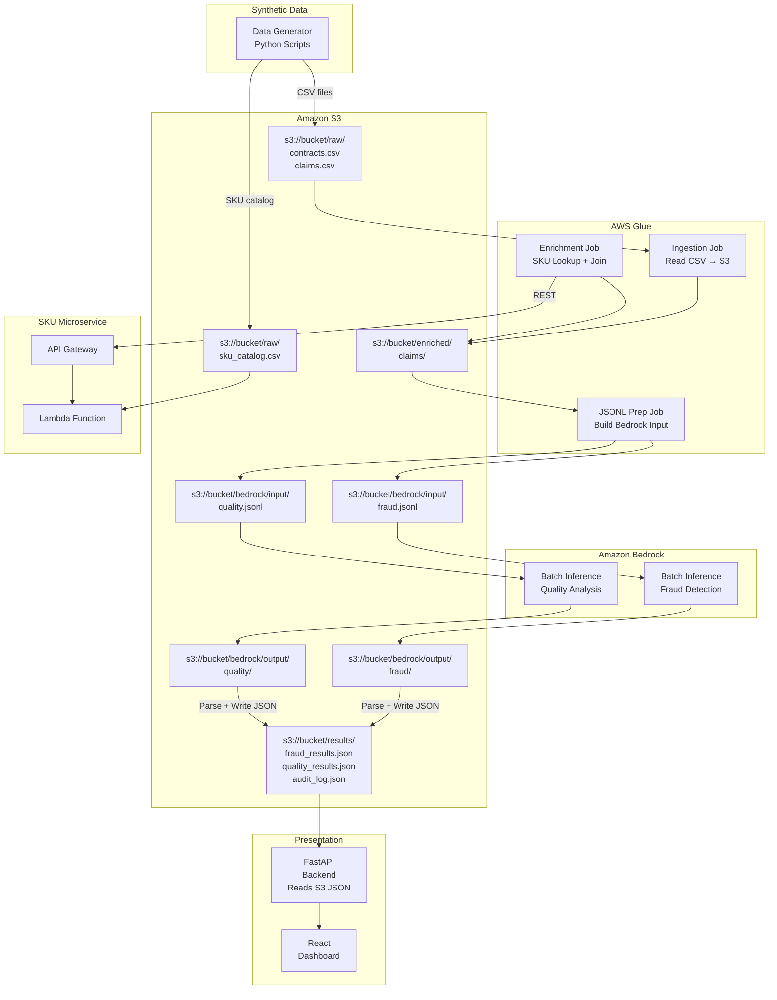
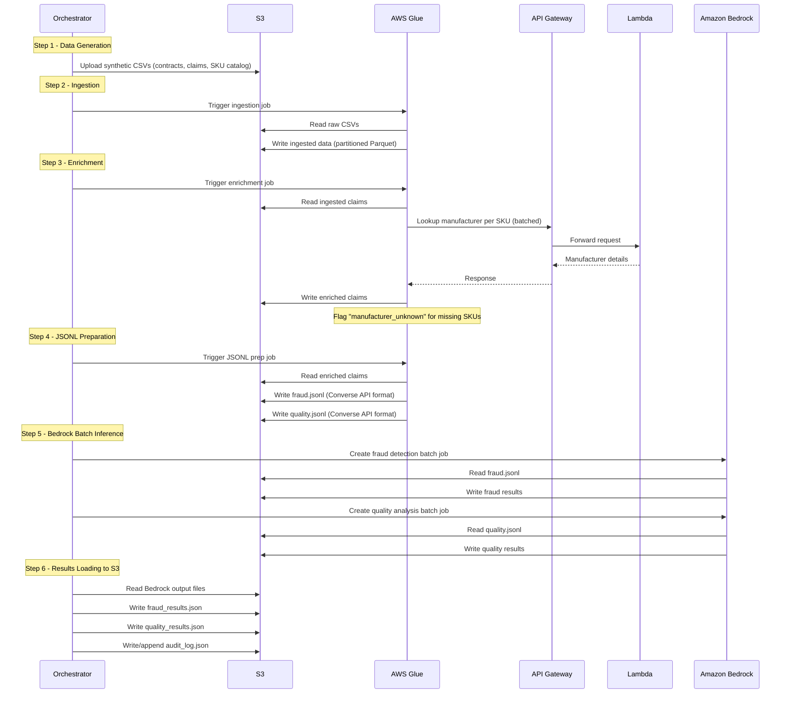

# Design Document: Fraud Detection & Quality Analysis

## Overview

This design describes a demo application built on AWS that ingests synthetic warranty data (10,000 contracts, 10,000 claims), enriches it with manufacturer details from an API Gateway + Lambda SKU microservice, and runs two AI-driven analyses via Amazon Bedrock batch inference: fraud detection on claims and manufacturer quality analysis. Results are written as JSON files to S3 by the results loader, and served through a FastAPI backend (which reads from S3) and React dashboard.

The system is scoped as a demo to validate the approach before production rollout. It prioritizes correctness, auditability, and demonstrating the AWS-native architecture. With only ~10K rows of results data, S3 JSON files are the simplest and most cost-effective storage option — no database infrastructure required.

### Key Design Decisions

| Decision | Rationale |
|---|---|
| Synthetic CSV data (10K rows each) | Replaces production data connection for demo; validates pipeline logic without production data access |
| Amazon S3 for all data storage | Central data lake for raw CSVs, enriched data, Bedrock batch I/O, and final results JSON |
| S3 JSON files as results store | 10K rows is trivial to load into memory; eliminates database infrastructure overhead for a demo |
| In-memory filtering/sorting/pagination | FastAPI loads JSON from S3 on startup; Python handles all query logic in-memory |
| AWS Glue for ETL | Managed PySpark; handles data ingestion, enrichment, and JSONL preparation without infrastructure management |
| API Gateway + Lambda for SKU microservice | Serverless, scalable lookup service for manufacturer details |
| Amazon Bedrock batch inference (Nova Pro) | Replaces custom model API; managed AI inference with structured JSONL input/output |
| Two separate Bedrock batch jobs | Fraud detection and quality analysis have different prompts and output schemas |
| React dashboard | Lightweight SPA for filtering, sorting, and exporting flagged items |
| AWS CDK (Python) for IaC | Defines all infrastructure as code; single `cdk deploy` provisions everything |
| Mangum adapter for FastAPI on Lambda | Translates API Gateway events to ASGI; zero-change deployment of existing FastAPI app |
| S3 + CloudFront for dashboard hosting | Cost-effective static site hosting with CDN edge caching |
| moto for AWS mocking in tests | Enables testing AWS service interactions without real AWS resources |

### Tech Stack (Demo)

- **Synthetic Data**: Python scripts generating CSV files (10K contracts, 10K claims, SKU catalog)
- **Storage**: Amazon S3 (all data including final results as JSON)
- **Data Processing**: AWS Glue (PySpark ETL jobs)
- **SKU Microservice**: Amazon API Gateway + AWS Lambda (Python)
- **AI/ML**: Amazon Bedrock batch inference with Amazon Nova Pro (`amazon.nova-pro-v1:0`)
- **Results Store**: S3 JSON files (`fraud_results.json`, `quality_results.json`, `audit_log.json`)
- **API Layer**: FastAPI (reads JSON from S3, serves in-memory)
- **Dashboard**: React + TypeScript + Vite
- **Testing**: pytest, Hypothesis (property-based testing), moto (AWS mocking)
- **Infrastructure**: AWS CDK (Python) — single stack defining all resources
- **API Deployment**: AWS Lambda + API Gateway HTTP API + Mangum adapter (wraps FastAPI)
- **Dashboard Hosting**: S3 static website bucket + CloudFront distribution

## Architecture

### High-Level Architecture



### Processing Flow



### Pipeline Stages

1. **Synthetic Data Generation**: Python scripts generate 10,000 contracts, 10,000 claims as CSV files, plus a SKU catalog. Uploaded to S3.
2. **Ingestion (Glue Job)**: Reads raw CSVs from S3, validates schema, writes partitioned data back to S3. Supports incremental ingestion via high-watermark timestamp.
3. **Enrichment (Glue Job)**: Reads ingested claims, calls API Gateway/Lambda SKU microservice in batches, joins manufacturer details, writes enriched data to S3.
4. **JSONL Preparation (Glue Job)**: Reads enriched claims, builds JSONL files in Bedrock Converse API format — one for fraud detection prompts, one for quality analysis prompts.
5. **Bedrock Batch Inference**: Two separate `create_model_invocation_job` calls using Amazon Nova Pro. Input/output via S3.
6. **Results Loading**: Parses Bedrock output from S3, extracts scores and analysis, writes `fraud_results.json`, `quality_results.json`, and `audit_log.json` to S3.

Each stage is idempotent: re-running with the same parameters produces the same output.


## Components and Interfaces

### 1. Synthetic Data Generator (`scripts/generate_data.py`)

Generates demo CSV data and uploads to S3.

```python
class DataGeneratorConfig:
    num_contracts: int = 10_000
    num_claims: int = 10_000
    num_skus: int = 500
    num_manufacturers: int = 50
    s3_bucket: str
    s3_prefix: str = "raw/"

class DataGenerator:
    def __init__(self, config: DataGeneratorConfig): ...
    def generate_contracts(self) -> pd.DataFrame: ...
    def generate_claims(self, contract_ids: list[str], skus: list[str]) -> pd.DataFrame: ...
    def generate_sku_catalog(self) -> pd.DataFrame: ...
    def upload_to_s3(self) -> None: ...
    def run(self) -> dict[str, int]: ...  # Returns counts per entity
```

Generated CSV schemas:
- **contracts.csv**: `contract_id, customer_id, sku, start_date, end_date, contract_type, created_at, updated_at`
- **claims.csv**: `claim_id, contract_id, sku, claim_date, claim_type, claim_amount, status, description, created_at, updated_at`
- **sku_catalog.csv**: `sku, manufacturer_id, manufacturer_name, product_category, product_name`

### 2. SKU Microservice (API Gateway + Lambda)

#### Lambda Function (`lambda/sku_lookup/handler.py`)

```python
def handler(event, context):
    """
    Handles SKU lookup requests.
    
    GET /sku/{sku_id} -> single SKU lookup
    POST /sku/batch -> batch SKU lookup (body: {"skus": ["SKU-001", ...]})
    
    Returns manufacturer details from SKU catalog stored in S3/DynamoDB.
    """

class SKULookupResponse:
    sku: str
    manufacturer_id: str
    manufacturer_name: str
    product_category: str
    product_name: str

class BatchSKUResponse:
    results: dict[str, SKULookupResponse]  # keyed by SKU
    not_found: list[str]  # SKUs with no manufacturer data
```

#### API Gateway Configuration

- `GET /sku/{sku_id}` → Lambda function (single lookup)
- `POST /sku/batch` → Lambda function (batch lookup, up to 100 SKUs per request)

### 3. Data Ingestion Glue Job (`glue/ingestion_job.py`)

```python
class IngestionConfig:
    s3_bucket: str
    raw_prefix: str = "raw/"
    ingested_prefix: str = "ingested/"
    high_watermark_timestamp: datetime | None  # None = full load
    max_retries: int = 3
    retry_backoff_base: float = 2.0

class IngestionSummary:
    contracts_extracted: int
    claims_extracted: int
    run_timestamp: datetime
    status: str  # "success" | "partial_failure" | "failure"
    errors: list[str]

class IngestionJob:
    def __init__(self, config: IngestionConfig, glue_context: GlueContext): ...
    def extract_contracts(self) -> DynamicFrame: ...
    def extract_claims(self) -> DynamicFrame: ...
    def run(self) -> IngestionSummary: ...
```

### 4. Enrichment Glue Job (`glue/enrichment_job.py`)

```python
class EnrichmentConfig:
    s3_bucket: str
    ingested_prefix: str = "ingested/"
    enriched_prefix: str = "enriched/"
    sku_api_url: str  # API Gateway endpoint
    batch_size: int = 100  # SKUs per batch API call
    retry_queue_prefix: str = "retry/"

class EnrichmentJob:
    def __init__(self, config: EnrichmentConfig, glue_context: GlueContext): ...
    def lookup_manufacturers(self, skus: list[str]) -> dict[str, SKULookupResponse]: ...
    def enrich_claims(self) -> DynamicFrame: ...
    def run(self) -> EnrichmentSummary: ...
```

### 5. JSONL Preparation Glue Job (`glue/jsonl_prep_job.py`)

Builds Bedrock Converse API format JSONL files.

```python
class JSONLPrepConfig:
    s3_bucket: str
    enriched_prefix: str = "enriched/"
    bedrock_input_prefix: str = "bedrock/input/"
    fraud_prompt_template: str
    quality_prompt_template: str
    max_tokens: int = 1024

class JSONLPrepJob:
    def __init__(self, config: JSONLPrepConfig, glue_context: GlueContext): ...
    def build_fraud_jsonl(self, claims: DynamicFrame) -> str: ...  # Returns S3 path
    def build_quality_jsonl(self, claims: DynamicFrame) -> str: ...  # Returns S3 path
    def format_fraud_record(self, claim: dict) -> dict: ...
    def format_quality_record(self, manufacturer_data: dict) -> dict: ...
    def run(self) -> dict[str, str]: ...  # Returns S3 paths for both JSONL files
```

**Fraud JSONL record format** (Converse API):
```json
{
    "recordId": "CLAIM-001",
    "modelInput": {
        "messages": [
            {
                "role": "user",
                "content": [
                    {
                        "type": "text",
                        "text": "Analyze this warranty claim for fraud indicators:\nClaim ID: CLAIM-001\nContract ID: CONTRACT-123\nSKU: SKU-456\nManufacturer: Acme Corp\nClaim Date: 2024-01-15\nClaim Type: repair\nClaim Amount: $1,250.00\nProduct Category: electronics\nDescription: Screen replacement needed\n\nProvide a fraud_score between 0 and 1, and list contributing_factors."
                    }
                ]
            }
        ],
        "inferenceConfig": {
            "maxTokens": 1024
        }
    }
}
```

**Quality JSONL record format** (Converse API):
```json
{
    "recordId": "MFR-001",
    "modelInput": {
        "messages": [
            {
                "role": "user",
                "content": [
                    {
                        "type": "text",
                        "text": "Analyze this manufacturer's warranty claim data for quality issues:\nManufacturer: Acme Corp\nTotal Claims: 450\nRepair Claims: 120\nRepair Claim Rate: 26.7%\nProduct Categories: electronics (300), appliances (150)\n\nProvide a quality_score representing deviation from expected baseline, and flag if quality_concern."
                    }
                ]
            }
        ],
        "inferenceConfig": {
            "maxTokens": 1024
        }
    }
}
```

### 6. Bedrock Batch Inference Orchestrator (`pipeline/bedrock_batch.py`)

```python
class BedrockBatchConfig:
    s3_bucket: str
    bedrock_input_prefix: str = "bedrock/input/"
    bedrock_output_prefix: str = "bedrock/output/"
    model_id: str = "amazon.nova-pro-v1:0"
    role_arn: str  # IAM role for Bedrock batch
    fraud_threshold: float = 0.7
    quality_threshold: float = 2.0

class BedrockBatchOrchestrator:
    def __init__(self, config: BedrockBatchConfig): ...
    
    def create_fraud_batch_job(self, input_s3_uri: str) -> str:
        """Creates Bedrock batch inference job for fraud detection. Returns job ARN."""
        bedrock = boto3.client("bedrock")
        response = bedrock.create_model_invocation_job(
            roleArn=self.config.role_arn,
            modelId=self.config.model_id,
            jobName=f"fraud-detection-{datetime.now().strftime('%Y%m%d-%H%M%S')}",
            inputDataConfig={"s3InputDataConfig": {"s3Uri": input_s3_uri}},
            outputDataConfig={"s3OutputDataConfig": {"s3Uri": f"s3://{self.config.s3_bucket}/{self.config.bedrock_output_prefix}fraud/"}}
        )
        return response["jobArn"]
    
    def create_quality_batch_job(self, input_s3_uri: str) -> str:
        """Creates Bedrock batch inference job for quality analysis. Returns job ARN."""
        ...
    
    def wait_for_job(self, job_arn: str, poll_interval: int = 30) -> str:
        """Polls job status until complete. Returns output S3 URI."""
        ...
    
    def parse_fraud_output(self, output_s3_uri: str) -> list[FraudResult]: ...
    def parse_quality_output(self, output_s3_uri: str) -> list[ManufacturerQualityResult]: ...
    def run(self) -> BatchRunSummary: ...
```

### 7. Results Loader (`pipeline/results_loader.py`)

Parses Bedrock output and writes results as JSON files to S3.

```python
class ResultsLoaderConfig:
    s3_bucket: str
    bedrock_output_prefix: str = "bedrock/output/"
    results_prefix: str = "results/"
    fraud_threshold: float = 0.7
    quality_threshold: float = 2.0

class FraudResult:
    claim_id: str
    contract_id: str
    sku: str | None
    manufacturer_name: str | None
    fraud_score: float  # 0.0 to 1.0
    is_suspected_fraud: bool
    contributing_factors: list[str]
    model_version: str
    scored_at: str  # ISO 8601 timestamp

class ManufacturerQualityResult:
    manufacturer_id: str
    manufacturer_name: str
    total_claims: int
    repair_claim_rate: float
    quality_score: float
    is_quality_concern: bool
    product_category_breakdown: dict[str, CategoryStats]
    model_version: str
    scored_at: str  # ISO 8601 timestamp

class CategoryStats:
    category: str
    claim_count: int
    repair_rate: float

class AuditLogEntry:
    event_type: str       # "fraud_flag", "quality_flag", "ingestion_run", "bedrock_batch"
    entity_type: str      # "claim", "manufacturer", "ingestion", "batch_job"
    entity_id: str
    model_version: str | None
    score: float | None
    details: dict
    created_at: str       # ISO 8601 timestamp

class ResultsLoader:
    def __init__(self, config: ResultsLoaderConfig, s3_client): ...
    def parse_fraud_output(self, output_s3_uri: str) -> list[FraudResult]: ...
    def parse_quality_output(self, output_s3_uri: str) -> list[ManufacturerQualityResult]: ...
    def flag_suspected_fraud(self, result: FraudResult) -> bool: ...
    def write_fraud_results(self, results: list[FraudResult]) -> None:
        """Writes fraud_results.json to S3 results prefix."""
        ...
    def write_quality_results(self, results: list[ManufacturerQualityResult]) -> None:
        """Writes quality_results.json to S3 results prefix."""
        ...
    def write_audit_log(self, entries: list[AuditLogEntry]) -> None:
        """Reads existing audit_log.json from S3 (if any), appends new entries, writes back."""
        ...
    def run(self) -> LoadSummary: ...
```

The results loader writes three JSON files to S3:
- `s3://bucket/results/fraud_results.json` — Array of `FraudResult` objects
- `s3://bucket/results/quality_results.json` — Array of `ManufacturerQualityResult` objects
- `s3://bucket/results/audit_log.json` — Array of `AuditLogEntry` objects (append-only: reads existing, appends, writes back)

### 8. API Layer (`api/`)

FastAPI backend that reads JSON files from S3 and serves them in-memory.

```python
# api/data_store.py
class S3DataStore:
    """Loads JSON result files from S3 into memory. Provides filtering, sorting, pagination."""
    
    def __init__(self, s3_client, bucket: str, results_prefix: str = "results/"): ...
    
    def load(self) -> None:
        """Reads fraud_results.json, quality_results.json, audit_log.json from S3 into memory."""
        ...
    
    def get_fraud_results(self, filters: dict, sort_by: str = "fraud_score", 
                          sort_desc: bool = True, page: int = 1, page_size: int = 50) -> PaginatedResult:
        """In-memory filtering, sorting, and pagination of fraud results."""
        ...
    
    def get_quality_results(self, filters: dict, sort_by: str = "quality_score",
                            sort_desc: bool = True, page: int = 1, page_size: int = 50) -> PaginatedResult:
        """In-memory filtering, sorting, and pagination of quality results."""
        ...
    
    def get_fraud_detail(self, claim_id: str) -> FraudResult | None: ...
    def get_quality_detail(self, manufacturer_id: str) -> ManufacturerQualityResult | None: ...
    def get_audit_logs(self, filters: dict) -> list[AuditLogEntry]: ...

# api/routes/fraud.py
GET  /api/v1/fraud/flagged          # List suspected fraud claims, sorted by score desc
GET  /api/v1/fraud/claims/{claim_id} # Claim detail with contributing factors
GET  /api/v1/fraud/export            # CSV export

# api/routes/quality.py
GET  /api/v1/quality/flagged         # List quality concern manufacturers, sorted by score desc
GET  /api/v1/quality/manufacturers/{id} # Manufacturer detail with category breakdown
GET  /api/v1/quality/export          # CSV export

# api/routes/audit.py
GET  /api/v1/audit/logs              # Audit log entries with filters

# Common query parameters for filtering:
# ?date_from=&date_to=&manufacturer=&category=&page=&page_size=
```

On startup, the FastAPI app creates an `S3DataStore` instance that loads all three JSON files from S3 into memory. With ~10K rows, this is trivial (< 10 MB). All filtering, sorting, and pagination happen in Python using list comprehensions and `sorted()`.

### 9. Dashboard (`dashboard/`)

React SPA with the following views:

- **Fraud Overview**: Table of suspected fraud claims, sortable by fraud score. Click-through to claim detail.
- **Quality Overview**: Table of flagged manufacturers, sortable by quality score. Click-through to manufacturer detail with category breakdown.
- **Filters**: Date range picker, manufacturer dropdown, product category dropdown.
- **Export**: CSV download button on each view.
- **Audit Trail**: Expandable audit log per flagged item.


### 10. AWS CDK Infrastructure (`infra/`)

AWS CDK (Python) stack that provisions all AWS resources in a single CloudFormation stack.

```python
# infra/app.py
import aws_cdk as cdk
from infra.stack import FraudDetectionStack

app = cdk.App()
FraudDetectionStack(app, "FraudDetectionStack")
app.synth()
```

```python
# infra/stack.py
from aws_cdk import (
    Stack, RemovalPolicy, Duration, CfnOutput,
    aws_s3 as s3,
    aws_lambda as _lambda,
    aws_apigateway as apigw,
    aws_apigatewayv2 as apigwv2,
    aws_apigatewayv2_integrations as apigwv2_integrations,
    aws_glue as glue,
    aws_iam as iam,
    aws_cloudfront as cloudfront,
    aws_cloudfront_origins as origins,
    aws_s3_deployment as s3deploy,
)
from constructs import Construct

class FraudDetectionStack(Stack):
    def __init__(self, scope: Construct, id: str, **kwargs):
        super().__init__(scope, id, **kwargs)
        
        # --- S3 Data Bucket ---
        # Stores raw CSVs, enriched data, Bedrock I/O, and results JSON
        self.data_bucket = s3.Bucket(self, "DataBucket",
            removal_policy=RemovalPolicy.DESTROY,
            auto_delete_objects=True,
        )
        
        # --- SKU Lookup Lambda ---
        self.sku_lambda = _lambda.Function(self, "SkuLookupFunction",
            runtime=_lambda.Runtime.PYTHON_3_12,
            handler="handler.handler",
            code=_lambda.Code.from_asset("lambda/sku_lookup"),
            environment={"S3_BUCKET": self.data_bucket.bucket_name},
            timeout=Duration.seconds(30),
        )
        self.data_bucket.grant_read(self.sku_lambda, "raw/sku_catalog.csv")
        
        # --- SKU API Gateway (REST) ---
        self.sku_api = apigw.RestApi(self, "SkuApi",
            rest_api_name="SKU Microservice",
        )
        sku_resource = self.sku_api.root.add_resource("sku")
        sku_id_resource = sku_resource.add_resource("{sku_id}")
        sku_id_resource.add_method("GET", apigw.LambdaIntegration(self.sku_lambda))
        batch_resource = sku_resource.add_resource("batch")
        batch_resource.add_method("POST", apigw.LambdaIntegration(self.sku_lambda))
        
        # --- Glue IAM Role ---
        self.glue_role = iam.Role(self, "GlueJobRole",
            assumed_by=iam.ServicePrincipal("glue.amazonaws.com"),
            managed_policies=[
                iam.ManagedPolicy.from_aws_managed_policy_name("service-role/AWSGlueServiceRole"),
            ],
        )
        self.data_bucket.grant_read_write(self.glue_role)
        
        # --- Glue Jobs ---
        # Ingestion, Enrichment, JSONL Preparation
        # Each job receives S3 bucket name and API Gateway URL as default arguments
        glue_default_args = {
            "--S3_BUCKET": self.data_bucket.bucket_name,
            "--SKU_API_URL": self.sku_api.url,
        }
        
        self.ingestion_job = glue.CfnJob(self, "IngestionJob",
            name="fraud-detection-ingestion",
            role=self.glue_role.role_arn,
            command=glue.CfnJob.JobCommandProperty(
                name="glueetl",
                script_location=f"s3://{self.data_bucket.bucket_name}/glue-scripts/ingestion_job.py",
                python_version="3",
            ),
            default_arguments=glue_default_args,
            glue_version="4.0",
            number_of_workers=2,
            worker_type="G.1X",
        )
        
        self.enrichment_job = glue.CfnJob(self, "EnrichmentJob",
            name="fraud-detection-enrichment",
            role=self.glue_role.role_arn,
            command=glue.CfnJob.JobCommandProperty(
                name="glueetl",
                script_location=f"s3://{self.data_bucket.bucket_name}/glue-scripts/enrichment_job.py",
                python_version="3",
            ),
            default_arguments=glue_default_args,
            glue_version="4.0",
            number_of_workers=2,
            worker_type="G.1X",
        )
        
        self.jsonl_prep_job = glue.CfnJob(self, "JsonlPrepJob",
            name="fraud-detection-jsonl-prep",
            role=self.glue_role.role_arn,
            command=glue.CfnJob.JobCommandProperty(
                name="glueetl",
                script_location=f"s3://{self.data_bucket.bucket_name}/glue-scripts/jsonl_prep_job.py",
                python_version="3",
            ),
            default_arguments=glue_default_args,
            glue_version="4.0",
            number_of_workers=2,
            worker_type="G.1X",
        )
        
        # --- Bedrock Batch Inference IAM Role ---
        self.bedrock_role = iam.Role(self, "BedrockBatchRole",
            assumed_by=iam.ServicePrincipal("bedrock.amazonaws.com"),
        )
        self.data_bucket.grant_read(self.bedrock_role, "bedrock/input/*")
        self.data_bucket.grant_write(self.bedrock_role, "bedrock/output/*")
        self.bedrock_role.add_to_policy(iam.PolicyStatement(
            actions=["bedrock:InvokeModel"],
            resources=["arn:aws:bedrock:*::foundation-model/amazon.nova-pro-v1:0"],
        ))
        
        # --- FastAPI Backend Lambda (Mangum) ---
        self.api_lambda = _lambda.Function(self, "ApiFunction",
            runtime=_lambda.Runtime.PYTHON_3_12,
            handler="api.main.handler",
            code=_lambda.Code.from_asset(".", exclude=["dashboard", "infra", ".venv", "tests", "node_modules"]),
            environment={
                "S3_BUCKET": self.data_bucket.bucket_name,
                "RESULTS_PREFIX": "results/",
            },
            timeout=Duration.seconds(30),
            memory_size=512,
        )
        self.data_bucket.grant_read(self.api_lambda, "results/*")
        
        # --- API Gateway HTTP API for FastAPI ---
        self.http_api = apigwv2.HttpApi(self, "HttpApi",
            api_name="Fraud Detection API",
            cors_preflight=apigwv2.CorsPreflightOptions(
                allow_origins=["*"],
                allow_methods=[apigwv2.CorsHttpMethod.ANY],
                allow_headers=["*"],
            ),
        )
        self.http_api.add_routes(
            path="/{proxy+}",
            methods=[apigwv2.HttpMethod.ANY],
            integration=apigwv2_integrations.HttpLambdaIntegration("ApiIntegration", self.api_lambda),
        )
        
        # --- Dashboard S3 Bucket + CloudFront ---
        self.dashboard_bucket = s3.Bucket(self, "DashboardBucket",
            removal_policy=RemovalPolicy.DESTROY,
            auto_delete_objects=True,
            block_public_access=s3.BlockPublicAccess.BLOCK_ALL,
        )
        
        self.distribution = cloudfront.Distribution(self, "DashboardDistribution",
            default_behavior=cloudfront.BehaviorOptions(
                origin=origins.S3BucketOrigin.with_origin_access_control(self.dashboard_bucket),
                viewer_protocol_policy=cloudfront.ViewerProtocolPolicy.REDIRECT_TO_HTTPS,
            ),
            default_root_object="index.html",
            error_responses=[
                cloudfront.ErrorResponse(
                    http_status=404,
                    response_page_path="/index.html",
                    response_http_status=200,
                ),
            ],
        )
        
        s3deploy.BucketDeployment(self, "DashboardDeployment",
            sources=[s3deploy.Source.asset("dashboard/dist")],
            destination_bucket=self.dashboard_bucket,
            distribution=self.distribution,
        )
        
        # --- Outputs ---
        CfnOutput(self, "DataBucketName", value=self.data_bucket.bucket_name)
        CfnOutput(self, "SkuApiUrl", value=self.sku_api.url)
        CfnOutput(self, "HttpApiUrl", value=self.http_api.url or "")
        CfnOutput(self, "DashboardUrl", value=f"https://{self.distribution.distribution_domain_name}")
        CfnOutput(self, "BedrockRoleArn", value=self.bedrock_role.role_arn)
```

**Mangum adapter integration** (`api/main.py` addition):

```python
# Add at the bottom of api/main.py
from mangum import Mangum
handler = Mangum(app)
```

This creates a `handler` callable that AWS Lambda invokes. Mangum translates API Gateway HTTP API events into ASGI requests for FastAPI.

**CDK project files**:
- `infra/app.py` — CDK app entry point
- `infra/stack.py` — Stack definition with all resources
- `infra/cdk.json` — CDK configuration pointing to `infra/app.py`
- `infra/requirements.txt` — CDK Python dependencies (`aws-cdk-lib`, `constructs`)


## Data Models

### S3 Results Layout

All processed results are stored as JSON files in S3:

```
s3://fraud-detection-demo/
├── results/
│   ├── fraud_results.json       # Array of FraudResult objects
│   ├── quality_results.json     # Array of ManufacturerQualityResult objects
│   └── audit_log.json           # Array of AuditLogEntry objects
```

### S3 Pipeline Data Layout

```
s3://fraud-detection-demo/
├── raw/
│   ├── contracts.csv              # 10,000 synthetic contracts
│   ├── claims.csv                 # 10,000 synthetic claims
│   └── sku_catalog.csv            # SKU → manufacturer mapping
├── ingested/
│   ├── contracts/
│   │   └── dt=YYYY-MM-DD/        # Partitioned by extraction date
│   │       └── *.parquet
│   └── claims/
│       └── dt=YYYY-MM-DD/
│           └── *.parquet
├── enriched/
│   └── claims/
│       └── dt=YYYY-MM-DD/
│           └── *.parquet          # Claims joined with manufacturer info
├── retry/
│   └── unenriched_claims/
│       └── *.parquet              # Claims where SKU lookup failed
├── bedrock/
│   ├── input/
│   │   ├── fraud.jsonl            # Bedrock batch input for fraud detection
│   │   └── quality.jsonl          # Bedrock batch input for quality analysis
│   └── output/
│       ├── fraud/                 # Bedrock batch output for fraud detection
│       │   └── *.jsonl.out
│       └── quality/               # Bedrock batch output for quality analysis
│           └── *.jsonl.out
├── results/
│   ├── fraud_results.json         # Final fraud results (JSON array)
│   ├── quality_results.json       # Final quality results (JSON array)
│   └── audit_log.json             # Audit log entries (JSON array)
```

### JSON Schema: fraud_results.json

```json
[
    {
        "claim_id": "CLAIM-00001",
        "contract_id": "CONTRACT-00123",
        "sku": "SKU-456",
        "manufacturer_name": "Acme Corp",
        "fraud_score": 0.85,
        "is_suspected_fraud": true,
        "contributing_factors": ["high claim amount", "repeat claimant"],
        "model_version": "nova-pro-v1",
        "scored_at": "2024-01-15T10:30:00Z",
        "batch_run_id": "fraud-detection-20240115-103000"
    }
]
```

### JSON Schema: quality_results.json

```json
[
    {
        "manufacturer_id": "MFR-001",
        "manufacturer_name": "Acme Corp",
        "total_claims": 450,
        "repair_claim_rate": 0.267,
        "quality_score": 3.5,
        "is_quality_concern": true,
        "product_category_breakdown": {
            "electronics": {"category": "electronics", "claim_count": 300, "repair_rate": 0.30},
            "appliances": {"category": "appliances", "claim_count": 150, "repair_rate": 0.20}
        },
        "model_version": "nova-pro-v1",
        "scored_at": "2024-01-15T10:30:00Z",
        "batch_run_id": "quality-analysis-20240115-103000"
    }
]
```

### JSON Schema: audit_log.json

```json
[
    {
        "event_type": "fraud_flag",
        "entity_type": "claim",
        "entity_id": "CLAIM-00001",
        "model_version": "nova-pro-v1",
        "score": 0.85,
        "details": {
            "contributing_factors": ["high claim amount", "repeat claimant"],
            "threshold": 0.7
        },
        "created_at": "2024-01-15T10:30:00Z"
    },
    {
        "event_type": "quality_flag",
        "entity_type": "manufacturer",
        "entity_id": "MFR-001",
        "model_version": "nova-pro-v1",
        "score": 3.5,
        "details": {
            "manufacturer_name": "Acme Corp",
            "total_claims": 450,
            "repair_claim_rate": 0.267,
            "threshold": 2.0
        },
        "created_at": "2024-01-15T10:30:00Z"
    },
    {
        "event_type": "ingestion_run",
        "entity_type": "ingestion",
        "entity_id": "run-20240115-100000",
        "model_version": null,
        "score": null,
        "details": {
            "source": "contracts",
            "records_extracted": 10000,
            "status": "success"
        },
        "created_at": "2024-01-15T10:00:00Z"
    }
]
```

### Key Data Contracts

**Contract record (synthetic CSV)**:
```python
contract_id: str          # e.g., "CONTRACT-00001"
customer_id: str          # e.g., "CUST-00001"
sku: str                  # e.g., "SKU-001"
start_date: datetime
end_date: datetime
contract_type: str        # "standard", "extended", "premium"
created_at: datetime
updated_at: datetime
```

**Claim record (synthetic CSV)**:
```python
claim_id: str             # e.g., "CLAIM-00001"
contract_id: str
sku: str
claim_date: datetime
claim_type: str           # "repair", "replacement", "refund"
claim_amount: float
status: str               # "open", "closed", "pending"
description: str
created_at: datetime
updated_at: datetime
```

**Enriched claim record**:
```python
# All claim fields plus:
manufacturer_id: str | None
manufacturer_name: str | None
manufacturer_unknown: bool
product_category: str | None
```

**Bedrock batch input record (Converse API format)**:
```json
{
    "recordId": "CLAIM-00001",
    "modelInput": {
        "messages": [
            {
                "role": "user",
                "content": [
                    {
                        "type": "text",
                        "text": "Analyze this warranty claim for fraud indicators: ..."
                    }
                ]
            }
        ],
        "inferenceConfig": {
            "maxTokens": 1024
        }
    }
}
```

**Bedrock batch output record**:
```json
{
    "recordId": "CLAIM-00001",
    "modelOutput": {
        "output": {
            "message": {
                "role": "assistant",
                "content": [
                    {
                        "text": "{\"fraud_score\": 0.85, \"contributing_factors\": [\"high claim amount\", \"repeat claimant\"], \"model_version\": \"nova-pro-v1\"}"
                    }
                ]
            }
        }
    }
}
```


## Correctness Properties

*A property is a characteristic or behavior that should hold true across all valid executions of a system — essentially, a formal statement about what the system should do. Properties serve as the bridge between human-readable specifications and machine-verifiable correctness guarantees.*

### Property 1: Incremental ingestion only extracts new or updated records

*For any* dataset of contracts or claims and any high-watermark timestamp, the set of records extracted by the ingestion Glue job should contain only records whose `updated_at` is greater than or equal to the watermark timestamp, and should contain all such records.

**Validates: Requirements 1.3**

### Property 2: Ingestion summary accuracy

*For any* ingestion run over any dataset of synthetic CSVs in S3, the `contracts_extracted` and `claims_extracted` counts in the ingestion summary should exactly equal the number of contract and claim records written to the output location in S3.

**Validates: Requirements 1.1, 1.2, 1.5**

### Property 3: Enrichment preserves claim data and adds manufacturer fields

*For any* claim record and any manufacturer lookup result from the SKU Lambda, the enriched record should contain all original claim fields unchanged, plus the manufacturer_id, manufacturer_name, and product_category from the lookup result.

**Validates: Requirements 2.1, 2.2**

### Property 4: Missing manufacturer data flags claim as unknown

*For any* claim where the SKU microservice (API Gateway + Lambda) returns no manufacturer data, the enriched record should have `manufacturer_unknown` set to True, and `manufacturer_name` and `manufacturer_id` set to None.

**Validates: Requirements 2.3**

### Property 5: Fraud score is bounded between 0 and 1

*For any* enriched claim processed through Bedrock batch inference and parsed by the results loader, the resulting `fraud_score` should be a number in the closed interval [0, 1].

**Validates: Requirements 3.1**

### Property 6: Threshold-based flagging is consistent

*For any* scored item (claim or manufacturer) and any configurable threshold, the `is_suspected_fraud` (or `is_quality_concern`) flag should be True if and only if the score exceeds the threshold.

**Validates: Requirements 3.2, 4.3**

### Property 7: Batch processing skips errors and continues

*For any* batch of items where some items cause errors (malformed Bedrock output or missing data), the results loader should produce valid results for all non-errored items and log errors for all errored items, with no results lost or duplicated.

**Validates: Requirements 3.5, 6.3, 6.4**

### Property 8: Repair claim rate calculation correctness

*For any* set of enriched claims grouped by manufacturer, the computed `repair_claim_rate` for each manufacturer should equal the count of claims with `claim_type == "repair"` divided by the total claim count for that manufacturer.

**Validates: Requirements 4.1, 4.2**

### Property 9: Category grouping covers all categories in data

*For any* set of enriched claims for a manufacturer, the `product_category_breakdown` should contain an entry for every distinct `product_category` present in that manufacturer's claims, and the sum of category claim counts should equal the manufacturer's total claims.

**Validates: Requirements 4.5**

### Property 10: Flagged results are sorted by score descending

*For any* list of flagged results (fraud or quality) returned by the FastAPI endpoints, the items should be sorted by their respective score in descending order.

**Validates: Requirements 5.1, 5.2**

### Property 11: Filter results match filter criteria

*For any* set of results and any combination of filters (date range, manufacturer, product category), every item in the filtered result set should satisfy all applied filter predicates.

**Validates: Requirements 5.5**

### Property 12: CSV export round trip

*For any* set of results, exporting to CSV and parsing the CSV back should produce a dataset equivalent to the original results (same rows, same values).

**Validates: Requirements 5.6**

### Property 13: Bedrock JSONL input conforms to Converse API schema

*For any* enriched claim, the formatted JSONL record produced by the JSONL preparation job should conform to the Bedrock Converse API schema: containing a `recordId` string and a `modelInput` object with a `messages` array containing a single user message with text content, plus an `inferenceConfig` with `maxTokens`.

**Validates: Requirements 6.5**

### Property 14: Audit log completeness for flagged items

*For any* item flagged as "suspected_fraud" or "quality_concern", the corresponding audit log entry should contain: timestamp, model_version, score, and detail fields (contributing_factors for fraud; manufacturer name, total claims, repair rate, and quality score for quality). For any ingestion run, the audit log should contain source, timestamp, and record count.

**Validates: Requirements 7.1, 7.2, 7.4, 3.3, 4.4**

### Property 15: CDK stack synthesizes all required resources

*For any* valid CDK stack synthesis, the resulting CloudFormation template should contain: an S3 data bucket, a SKU lookup Lambda function, a REST API Gateway for the SKU microservice, three Glue jobs (ingestion, enrichment, JSONL prep), a Bedrock batch inference IAM role, a FastAPI Lambda function, an HTTP API Gateway, a dashboard S3 bucket, and a CloudFront distribution.

**Validates: Requirements 8.1, 8.2, 8.3, 8.4, 8.5, 8.6, 8.7, 8.8**


## Error Handling

### S3 / Data Access Errors

| Error | Handling | Recovery |
|---|---|---|
| S3 bucket not accessible | Retry up to 3 times with exponential backoff (2^attempt seconds) | Log failure after retries exhausted; ingestion summary status = "failure" |
| CSV file missing or corrupt | Log error, mark summary as "failure" | Re-upload synthetic data, re-run ingestion |
| S3 write failure | Retry with backoff | Glue job fails after retries; re-run job |
| Results JSON file missing on API startup | Log warning, serve empty results | Re-run results loader to regenerate JSON files |
| Results JSON file malformed | Log error, serve empty results for affected dataset | Re-run results loader |

### Enrichment Pipeline Errors

| Error | Handling | Recovery |
|---|---|---|
| API Gateway / Lambda unavailable | Queue unenriched claims to retry S3 path | Retry job picks up queued claims on next run |
| SKU not found (no manufacturer data) | Flag claim as `manufacturer_unknown`, continue | Claims still processed by Bedrock with null manufacturer |
| API Gateway timeout | Treat as unavailable, queue for retry | Same as unavailable |
| Lambda throttling (429) | Exponential backoff on batch requests | Reduce batch size or increase Lambda concurrency |

### Bedrock Batch Inference Errors

| Error | Handling | Recovery |
|---|---|---|
| Batch job creation failure | Log error with job parameters | Check IAM role permissions, S3 paths; retry |
| Batch job timeout | Poll detects timeout status | Re-submit batch job |
| Malformed JSONL input | Bedrock rejects job | Validate JSONL format before submission |
| Partial output (some records failed) | Parse successful records, log failed recordIds | Re-run with failed records only |
| Model output unparseable | Skip record, log error with recordId | Manual review; adjust prompt template |
| Score out of range [0,1] | Reject score, log anomaly | Adjust prompt to enforce range; manual review |

### Results Loading Errors

| Error | Handling | Recovery |
|---|---|---|
| Bedrock output S3 path missing | Log error, abort loading | Check batch job status; re-run if needed |
| JSON parse error in output | Skip record, log error with recordId | Re-run batch for failed records |
| S3 write failure for results JSON | Retry with backoff up to 3 times | Re-run results loader |
| Existing audit_log.json read failure | Start fresh audit log, log warning | Previous audit entries lost; acceptable for demo |

### API / Dashboard Errors

| Error | Handling | Recovery |
|---|---|---|
| S3 JSON file not found on startup | Return empty results, log warning | Run results loader to populate S3 |
| S3 read failure during reload | Serve stale in-memory data, log error | Retry on next request or manual reload |
| Invalid filter parameters | Return 400 with validation error details | Client-side validation in dashboard |
| CSV export timeout (large dataset) | Paginate export, stream response | Increase page size or add background export job |


## Testing Strategy

### Dual Testing Approach

This project uses both unit tests and property-based tests for comprehensive coverage:

- **Unit tests** (pytest): Verify specific examples, edge cases, integration points, and error conditions
- **Property-based tests** (Hypothesis): Verify universal properties across randomly generated inputs
- **AWS mocking** (moto): Mock S3, Lambda, API Gateway, and Bedrock interactions in tests

Both are complementary. Unit tests catch concrete bugs with known inputs. Property tests verify general correctness across the input space.

### Property-Based Testing Configuration

- **Library**: [Hypothesis](https://hypothesis.readthedocs.io/) for Python
- **AWS Mocking**: [moto](https://github.com/getmoto/moto) for S3, Lambda, and other AWS services
- **Minimum iterations**: 100 per property test (via `@settings(max_examples=100)`)
- **Each property test MUST reference its design property** with a tag comment:
  ```python
  # Feature: fraud-detection-quality-analysis, Property 1: Incremental ingestion only extracts new or updated records
  ```
- **Each correctness property is implemented by a single property-based test**

### Test Organization

```
tests/
├── unit/
│   ├── test_data_generator.py       # Synthetic data generation validation
│   ├── test_ingestion.py            # Ingestion job examples, retry behavior
│   ├── test_enrichment.py           # SKU lookup examples, unknown manufacturer
│   ├── test_jsonl_prep.py           # JSONL format examples, prompt templates
│   ├── test_bedrock_batch.py        # Batch job creation, polling, output parsing
│   ├── test_results_loader.py       # Result parsing, threshold flagging, S3 JSON writing
│   ├── test_data_store.py           # S3DataStore loading, filtering, sorting, pagination
│   ├── test_api.py                  # API endpoint examples, filter validation
│   └── test_csv_export.py           # CSV format examples
├── property/
│   ├── test_ingestion_props.py      # Properties 1, 2
│   ├── test_enrichment_props.py     # Properties 3, 4
│   ├── test_fraud_props.py          # Properties 5, 6, 7
│   ├── test_quality_props.py        # Properties 6, 8, 9
│   ├── test_api_props.py            # Properties 10, 11
│   ├── test_csv_props.py            # Property 12
│   ├── test_jsonl_props.py          # Property 13
│   └── test_audit_props.py          # Property 14
└── conftest.py                      # Shared fixtures, Hypothesis strategies, moto mocks
```

### Unit Test Focus Areas

- S3 read/write retry logic (3 retries, exponential backoff) — Requirement 1.4
- SKU Lambda unavailability queuing — Requirement 2.4
- Bedrock batch job creation with correct parameters — Requirements 6.1, 6.2
- Bedrock output parsing (valid and malformed responses) — Requirements 3.1, 3.5
- S3DataStore loading and in-memory query logic — Requirements 5.1, 5.2
- Results loader writing JSON to S3 — Requirements 3.1, 4.1
- Claim detail API response structure — Requirement 5.3
- Manufacturer detail API response structure — Requirement 5.4
- Audit log API access — Requirement 7.3
- Synthetic data generation (correct counts, valid schemas) — Requirement 1.1, 1.2

### Hypothesis Strategies (Generators)

Key custom strategies for property tests:

```python
# Generate random claim records
claims = st.fixed_dictionaries({
    "claim_id": st.text(min_size=1, max_size=20, alphabet=st.characters(whitelist_categories=("L", "N"))),
    "contract_id": st.text(min_size=1, max_size=20, alphabet=st.characters(whitelist_categories=("L", "N"))),
    "sku": st.text(min_size=1, max_size=30, alphabet=st.characters(whitelist_categories=("L", "N"))),
    "claim_date": st.datetimes(),
    "claim_type": st.sampled_from(["repair", "replacement", "refund"]),
    "claim_amount": st.floats(min_value=0, max_value=100000, allow_nan=False),
    "status": st.sampled_from(["open", "closed", "pending"]),
    "updated_at": st.datetimes(),
})

# Generate random fraud scores
fraud_scores = st.floats(min_value=0.0, max_value=1.0, allow_nan=False)

# Generate random thresholds
thresholds = st.floats(min_value=0.0, max_value=1.0, allow_nan=False)

# Generate random manufacturer data
manufacturers = st.fixed_dictionaries({
    "manufacturer_id": st.text(min_size=1, max_size=20, alphabet=st.characters(whitelist_categories=("L", "N"))),
    "manufacturer_name": st.text(min_size=1, max_size=100),
    "product_category": st.sampled_from(["electronics", "appliances", "automotive", "furniture"]),
})

# Generate Bedrock JSONL records
bedrock_records = st.fixed_dictionaries({
    "recordId": st.text(min_size=1, max_size=30, alphabet=st.characters(whitelist_categories=("L", "N", "Pd"))),
    "modelInput": st.fixed_dictionaries({
        "messages": st.just([{"role": "user", "content": [{"type": "text", "text": "test prompt"}]}]),
        "inferenceConfig": st.fixed_dictionaries({"maxTokens": st.integers(min_value=1, max_value=4096)}),
    }),
})
```

### Demo Scope Testing Notes

Since this is a demo application:
- AWS service interactions are mocked using moto (S3, Lambda)
- Bedrock batch inference is mocked with deterministic output files in S3
- S3DataStore is tested with moto-mocked S3 containing sample JSON files
- No database setup required — all results are JSON files in S3
- Dashboard tests use React Testing Library for component behavior, not visual regression
- Synthetic data generator is tested for schema correctness and row counts
