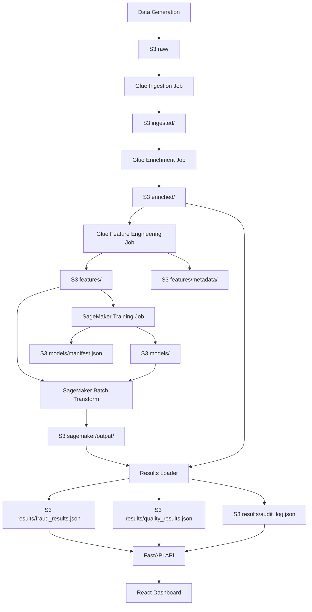

# Design Document: Unsupervised Anomaly Detection

## Overview

This design replaces the LLM-based Bedrock batch inference pipeline with an unsupervised anomaly detection system built on Amazon SageMaker Random Cut Forest (RCF). The current pipeline flows: synthetic data → S3 → Glue ingestion → Glue enrichment → JSONL prep → Bedrock batch inference → results loader → API → dashboard. The new pipeline removes the JSONL prep and Bedrock stages, inserting: Glue feature engineering → SageMaker training → SageMaker batch transform → updated results loader.

The key architectural change is moving from per-record LLM prompting (expensive, slow at 88M claims) to a statistical ML model that scores all claims in batch. The existing ingestion/enrichment Glue jobs, FastAPI API, and React dashboard remain unchanged. The results loader is updated to read SageMaker output instead of Bedrock output, normalize scores, compute contributing factors, and aggregate manufacturer quality scores.

## Architecture



### Pipeline Stage Mapping (Old → New)

| Stage | Old | New |
|-------|-----|-----|
| 1 | Data Generation | Data Generation (unchanged) |
| 2 | Ingestion | Ingestion (unchanged) |
| 3 | Enrichment | Enrichment (unchanged) |
| 4 | JSONL Prep | Feature Engineering |
| 5 | Bedrock Batch Inference | SageMaker Training |
| 6 | Results Loading | SageMaker Batch Transform |
| 7 | — | Results Loading |

## Components and Interfaces

### 1. Feature Engineering Glue Job (`glue/feature_engineering_job.py`)

Replaces `glue/jsonl_prep_job.py`. Reads enriched Parquet from `enriched/`, produces numerical feature matrix.

```python
@dataclass
class FeatureEngineeringConfig:
    s3_bucket: str
    enriched_prefix: str = "enriched/"
    features_prefix: str = "features/"
    feature_columns: list[str] = field(default_factory=lambda: [
        "claim_amount",
        "days_between_contract_start_and_claim",
    ])
    categorical_columns: list[str] = field(default_factory=lambda: [
        "claim_type",
        "product_category",
    ])

class FeatureEngineeringJob:
    def __init__(self, config: FeatureEngineeringConfig, spark: SparkSession)
    def compute_manufacturer_frequency(self, claims_df: DataFrame) -> DataFrame
    def one_hot_encode(self, df: DataFrame, columns: list[str]) -> DataFrame
    def compute_days_feature(self, df: DataFrame) -> DataFrame
    def impute_missing(self, df: DataFrame) -> DataFrame
    def standard_scale(self, df: DataFrame, columns: list[str]) -> tuple[DataFrame, dict]
    def run(self) -> dict[str, str]
```

**Input**: Enriched claims Parquet at `s3://{bucket}/enriched/claims/`
**Output**:
- Feature matrix Parquet at `s3://{bucket}/features/claim_features.parquet` (columns: claim_id + numerical features)
- Feature metadata JSON at `s3://{bucket}/features/metadata/feature_metadata.json`
- Scaler parameters JSON at `s3://{bucket}/features/metadata/scaler_params.json`

**Feature vector per claim**:
- `claim_amount` (continuous, scaled)
- `days_between_contract_start_and_claim` (continuous, scaled)
- `claim_type_repair`, `claim_type_replacement`, `claim_type_refund` (one-hot)
- `product_category_electronics`, `product_category_appliances`, `product_category_automotive`, `product_category_furniture` (one-hot)
- `manufacturer_claim_frequency` (continuous, scaled)

**Missing value handling**:
- Numerical nulls → column median
- Categorical nulls → "unknown" category (gets its own one-hot column)

**Scaler parameters** (persisted for inference consistency):
```json
{
  "claim_amount": {"mean": 1234.56, "std": 789.01},
  "days_between_contract_start_and_claim": {"mean": 365.0, "std": 200.0},
  "manufacturer_claim_frequency": {"mean": 50.0, "std": 30.0}
}
```

### 2. SageMaker Training Module (`pipeline/sagemaker_training.py`)

New module replacing `pipeline/bedrock_batch.py`.

```python
@dataclass
class SageMakerTrainingConfig:
    s3_bucket: str
    features_prefix: str = "features/"
    models_prefix: str = "models/"
    sagemaker_role_arn: str = ""
    instance_type: str = "ml.m5.xlarge"
    instance_count: int = 1
    num_trees: int = 100
    num_samples_per_tree: int = 256

class SageMakerTrainingJob:
    def __init__(self, config: SageMakerTrainingConfig, sagemaker_client=None)
    def get_feature_dim(self) -> int
    def create_training_job(self) -> str
    def wait_for_training(self, job_name: str) -> str
    def write_training_manifest(self, job_name: str, model_artifact_path: str, metadata: dict) -> None
    def run(self) -> dict[str, str]
```

**Input**: Feature Parquet at `s3://{bucket}/features/`
**Output**:
- Model artifact at `s3://{bucket}/models/{timestamp}/model.tar.gz`
- Training manifest at `s3://{bucket}/models/{timestamp}/manifest.json`

**Training manifest schema**:
```json
{
  "job_name": "anomaly-detection-20240101-120000",
  "model_artifact_s3_path": "s3://bucket/models/20240101-120000/model.tar.gz",
  "training_duration_seconds": 300,
  "record_count": 88000000,
  "hyperparameters": {
    "num_trees": 100,
    "num_samples_per_tree": 256,
    "feature_dim": 10
  },
  "created_at": "2024-01-01T12:05:00Z"
}
```

### 3. SageMaker Batch Transform Module (`pipeline/sagemaker_batch_transform.py`)

```python
@dataclass
class SageMakerBatchTransformConfig:
    s3_bucket: str
    features_prefix: str = "features/"
    sagemaker_output_prefix: str = "sagemaker/output/"
    model_artifact_path: str = ""
    instance_type: str = "ml.m5.xlarge"
    instance_count: int = 2

class SageMakerBatchTransform:
    def __init__(self, config: SageMakerBatchTransformConfig, sagemaker_client=None)
    def create_model(self, model_artifact_path: str) -> str
    def create_transform_job(self, model_name: str) -> str
    def wait_for_transform(self, job_name: str) -> str
    def run(self, model_artifact_path: str) -> dict[str, str]
```

**Input**: Feature Parquet at `s3://{bucket}/features/`, model artifact
**Output**: Per-claim scores at `s3://{bucket}/sagemaker/output/` (CSV: claim_id, anomaly_score)

### 4. Updated Results Loader (`pipeline/results_loader.py`)

The existing `ResultsLoader` is updated to read SageMaker batch transform output instead of Bedrock JSONL output. The output schemas (`FraudResult`, `ManufacturerQualityResult`, `AuditLogEntry`) remain identical to preserve API compatibility.

**Key changes**:
- `ResultsLoaderConfig`: Replace `bedrock_output_prefix` with `sagemaker_output_prefix` and `features_prefix`. Add `enriched_prefix` for joining back claim metadata.
- New `normalize_scores(scores: list[float]) -> list[float]`: Min-max normalization to [0, 1].
- New `compute_contributing_factors(claim_features: dict, scaler_params: dict) -> list[str]`: Top 3 features by absolute z-score deviation.
- New `aggregate_manufacturer_quality(fraud_results, enriched_claims) -> list[ManufacturerQualityResult]`: Groups by manufacturer, computes mean anomaly score, std-dev based quality_score.
- `parse_fraud_output` → `parse_sagemaker_output`: Reads CSV output, joins with enriched claims for metadata, normalizes scores, computes contributing factors.
- `parse_quality_output` → removed (replaced by `aggregate_manufacturer_quality`).

```python
@dataclass
class ResultsLoaderConfig:
    s3_bucket: str
    sagemaker_output_prefix: str = "sagemaker/output/"
    features_prefix: str = "features/"
    enriched_prefix: str = "enriched/"
    results_prefix: str = "results/"
    fraud_threshold: float = 0.7
    quality_threshold: float = 2.0

class ResultsLoader:
    def normalize_scores(self, raw_scores: list[float]) -> list[float]
    def compute_contributing_factors(self, claim_features: dict[str, float], scaler_params: dict) -> list[str]
    def aggregate_manufacturer_quality(self, fraud_results: list[FraudResult], enriched_claims: DataFrame) -> list[ManufacturerQualityResult]
    def parse_sagemaker_output(self) -> tuple[list[FraudResult], list[str]]
    def flag_suspected_fraud(self, result: FraudResult) -> bool
    def run(self) -> LoadSummary
```

### 5. Updated Pipeline Orchestrator (`run_pipeline.py`)

**Stage enum changes**:
```python
class Stage(IntEnum):
    DATA_GENERATION = 1
    INGESTION = 2
    ENRICHMENT = 3
    FEATURE_ENGINEERING = 4
    SAGEMAKER_TRAINING = 5
    SAGEMAKER_BATCH_TRANSFORM = 6
    RESULTS_LOADING = 7
```

**New CLI flags**:
- `--skip-training`: Reuses most recent model artifact from `models/` prefix instead of retraining. Finds latest by listing `models/*/manifest.json` and sorting by timestamp.
- `--stage`: Updated choices to include `feature_engineering`, `training`, `transform`, `results`.
- `--create-user PASSWORD`: Creates or resets the demo Cognito user (`demo@example.com`) with the provided password via `admin-create-user` and `admin-set-user-password`.
- Remove `--mock`, `--skip-bedrock`.

### 6. Updated CDK Stack (`infra/stack.py`)

**Additions**:
- SageMaker IAM role with S3 read/write on data bucket, `sagemaker:CreateTrainingJob`, `sagemaker:CreateTransformJob`, `sagemaker:CreateModel`, `sagemaker:DescribeTrainingJob`, `sagemaker:DescribeTransformJob`
- Feature Engineering Glue job resource
- Cognito User Pool (email sign-in, no self-sign-up), App Client (OAuth2 PKCE), Hosted UI domain, demo user (`demo@example.com`)

**Removals**:
- `self.bedrock_role` (Bedrock batch inference IAM role)
- `self.jsonl_prep_job` (JSONL preparation Glue job)

**Retained** (unchanged):
- S3 data bucket, ingestion Glue job, enrichment Glue job, SKU Lambda + API Gateway, API Lambda + HTTP API Gateway, dashboard S3 bucket + CloudFront

### 7. Updated Config (`config.py`)

**Additions**:
```python
# SageMaker
features_prefix: str = "features/"
models_prefix: str = "models/"
sagemaker_output_prefix: str = "sagemaker/output/"
sagemaker_role_arn: str = ""
sagemaker_instance_type: str = "ml.m5.xlarge"
sagemaker_training_instance_count: int = 1
sagemaker_transform_instance_count: int = 2
num_trees: int = 100
num_samples_per_tree: int = 256
```

**Removals**:
- `bedrock_input_prefix`, `bedrock_output_prefix`, `bedrock_model_id`, `bedrock_role_arn`, `bedrock_max_tokens`
- `fraud_prompt_template`, `quality_prompt_template`

## Data Models

### Feature Matrix Schema (Parquet)

| Column | Type | Description |
|--------|------|-------------|
| claim_id | string | Primary key, carried through for joining |
| claim_amount | float64 | Standard-scaled claim dollar amount |
| days_between_contract_start_and_claim | float64 | Standard-scaled days between contract start and claim date |
| claim_type_repair | int8 | One-hot: 1 if claim_type == "repair" |
| claim_type_replacement | int8 | One-hot: 1 if claim_type == "replacement" |
| claim_type_refund | int8 | One-hot: 1 if claim_type == "refund" |
| claim_type_unknown | int8 | One-hot: 1 if claim_type was null/missing |
| product_category_electronics | int8 | One-hot |
| product_category_appliances | int8 | One-hot |
| product_category_automotive | int8 | One-hot |
| product_category_furniture | int8 | One-hot |
| product_category_unknown | int8 | One-hot: 1 if product_category was null/missing |
| manufacturer_claim_frequency | float64 | Standard-scaled count of claims per manufacturer |

### Scaler Parameters Schema (JSON)

```json
{
  "claim_amount": {"mean": 0.0, "std": 1.0},
  "days_between_contract_start_and_claim": {"mean": 0.0, "std": 1.0},
  "manufacturer_claim_frequency": {"mean": 0.0, "std": 1.0}
}
```

### Feature Metadata Schema (JSON)

```json
{
  "feature_columns": ["claim_amount", "days_between_contract_start_and_claim", ...],
  "feature_types": {"claim_amount": "continuous", "claim_type_repair": "one_hot", ...},
  "feature_dim": 13,
  "scaler_params_path": "s3://bucket/features/metadata/scaler_params.json",
  "created_at": "2024-01-01T12:00:00Z"
}
```

### SageMaker Batch Transform Output (CSV)

```
claim_id,anomaly_score
CLAIM-00001,3.45
CLAIM-00002,1.12
...
```

Raw RCF anomaly scores are unbounded positive floats. Higher = more anomalous.

### Fraud Results Schema (unchanged)

```json
{
  "claim_id": "CLAIM-00001",
  "contract_id": "CONTRACT-00001",
  "fraud_score": 0.85,
  "is_suspected_fraud": true,
  "contributing_factors": ["claim_amount", "days_between_contract_start_and_claim", "manufacturer_claim_frequency"],
  "model_version": "models/20240101-120000/model.tar.gz",
  "scored_at": "2024-01-01T12:10:00Z"
}
```

### Quality Results Schema (unchanged)

```json
{
  "manufacturer_id": "MFR-00001",
  "manufacturer_name": "Manufacturer_1",
  "total_claims": 150,
  "repair_claim_rate": 0.45,
  "quality_score": 2.5,
  "is_quality_concern": true,
  "product_category_breakdown": {
    "electronics": {"category": "electronics", "claim_count": 80, "repair_rate": 0.5},
    "appliances": {"category": "appliances", "claim_count": 70, "repair_rate": 0.4}
  },
  "sku_breakdown": {
    "SKU-00001": {"sku": "SKU-00001", "claim_count": 30, "repair_count": 18, "repair_rate": 0.6},
    "SKU-00002": {"sku": "SKU-00002", "claim_count": 25, "repair_count": 8, "repair_rate": 0.32}
  },
  "model_version": "models/20240101-120000/model.tar.gz",
  "scored_at": "2024-01-01T12:10:00Z"
}
```

### Audit Log Schema (unchanged)

```json
{
  "event_type": "fraud_flag",
  "entity_type": "claim",
  "entity_id": "CLAIM-00001",
  "model_version": "models/20240101-120000/model.tar.gz",
  "score": 0.85,
  "details": {
    "contributing_factors": ["claim_amount", "days_between_contract_start_and_claim"],
    "threshold": 0.7
  },
  "created_at": "2024-01-01T12:10:00Z"
}
```


## Correctness Properties

*A property is a characteristic or behavior that should hold true across all valid executions of a system — essentially, a formal statement about what the system should do. Properties serve as the bridge between human-readable specifications and machine-verifiable correctness guarantees.*

### Property 1: Feature engineering produces complete feature vectors

*For any* enriched claims DataFrame with valid columns (claim_amount, claim_date, contract start_date, claim_type, product_category, manufacturer_id), the feature engineering output shall contain exactly one row per input claim and include all expected feature columns: claim_amount, days_between_contract_start_and_claim, one-hot columns for claim_type and product_category, and manufacturer_claim_frequency.

**Validates: Requirements 1.1, 1.2**

### Property 2: Standard scaling round-trip via persisted parameters

*For any* set of enriched claims, if the feature engineering job produces scaled features and persisted scaler parameters (mean, std per continuous column), then applying the inverse transform using those parameters shall recover the original unscaled values (within floating-point tolerance).

**Validates: Requirements 1.3, 1.4**

### Property 3: Missing value imputation produces no nulls

*For any* enriched claims DataFrame with randomly placed null values in feature columns, after imputation, the output DataFrame shall contain zero null values, numerical nulls shall be replaced with the column median of non-null values, and categorical nulls shall produce a 1 in the corresponding "unknown" one-hot column.

**Validates: Requirements 1.5**

### Property 4: Feature metadata consistency

*For any* feature engineering run, the feature metadata file shall list exactly the same column names as the actual feature matrix output, the feature_dim shall equal the number of feature columns (excluding claim_id), and the feature types shall correctly classify each column as "continuous" or "one_hot".

**Validates: Requirements 1.6**

### Property 5: Training manifest contains all required fields

*For any* completed training job with given hyperparameters and record count, the training manifest JSON shall contain all required fields (job_name, model_artifact_s3_path, training_duration_seconds, record_count, hyperparameters, created_at) and the hyperparameters sub-object shall match the configured values.

**Validates: Requirements 2.2, 2.4**

### Property 6: Min-max normalization bounds

*For any* non-empty list of raw anomaly scores (with at least two distinct values), after min-max normalization, all normalized scores shall be in the range [0.0, 1.0], the minimum raw score shall map to 0.0, and the maximum raw score shall map to 1.0.

**Validates: Requirements 4.1**

### Property 7: Fraud threshold flagging

*For any* claim with a normalized anomaly score and any configured fraud threshold in (0, 1), the claim shall be flagged as suspected fraud if and only if its normalized score exceeds the threshold.

**Validates: Requirements 4.2**

### Property 8: Contributing factors are top-3 by deviation

*For any* claim feature vector and scaler parameters, the contributing_factors list shall contain exactly the 3 feature names with the highest absolute z-score deviation from the population mean, ordered by descending absolute deviation.

**Validates: Requirements 4.3**

### Property 9: Fraud result schema completeness

*For any* list of FraudResult objects produced by the results loader, each serialized JSON record shall contain all required fields (claim_id, contract_id, fraud_score, is_suspected_fraud, contributing_factors, model_version, scored_at), fraud_score shall be in [0.0, 1.0], and model_version shall match the SageMaker model artifact path used for scoring.

**Validates: Requirements 4.4, 4.5**

### Property 10: Manufacturer quality aggregation correctness

*For any* set of per-claim fraud results grouped by manufacturer_id, the aggregated manufacturer quality result shall have: total_claims equal to the count of claims for that manufacturer, repair_claim_rate equal to the fraction of claims with claim_type "repair", and the per-category breakdown claim counts summing to total_claims.

**Validates: Requirements 5.1**

### Property 11: Quality score is z-score of manufacturer mean

*For any* set of manufacturers with computed mean anomaly scores, the quality_score for each manufacturer shall equal (manufacturer_mean - population_mean) / population_std, where population_mean and population_std are computed across all manufacturers' mean scores.

**Validates: Requirements 5.2**

### Property 12: Quality threshold flagging

*For any* manufacturer with a computed quality_score and any configured quality threshold, the manufacturer shall be flagged as a quality concern if and only if its quality_score exceeds the threshold.

**Validates: Requirements 5.3**

### Property 13: Audit entries match flagged entities

*For any* set of fraud results and quality results, the audit log shall contain exactly one entry per flagged claim (with event_type "fraud_flag", correct claim_id, score, threshold, and contributing_factors) and exactly one entry per flagged manufacturer (with event_type "quality_flag", correct manufacturer_id, quality_score, and threshold). No audit entries shall exist for unflagged entities.

**Validates: Requirements 6.1, 6.2**

### Property 14: Pipeline stage ordering with --stage flag

*For any* valid stage name, when the pipeline is started with that stage, only stages from that point onward shall execute, and they shall execute in the defined order (data_generation < ingestion < enrichment < feature_engineering < training < transform < results).

**Validates: Requirements 7.3**

### Property 15: Pipeline halts on stage failure

*For any* pipeline run where a stage raises an exception, all subsequent stages shall not execute, the error shall be recorded in the pipeline result's errors list, and the stages_completed list shall not include the failed stage or any later stage.

**Validates: Requirements 7.4**

## Error Handling

### Feature Engineering Job
- **Null/missing values**: Imputed per Requirement 1.5 (median for numerical, "unknown" for categorical). No records are dropped.
- **Empty input**: If the enriched claims Parquet is empty, the job writes an empty feature matrix and logs a warning. Downstream stages handle empty input gracefully.
- **Schema mismatch**: If expected columns are missing from enriched data, the job raises a `ValueError` with a descriptive message listing missing columns. The pipeline orchestrator catches this and halts.

### SageMaker Training
- **API failure**: If `create_training_job` or `describe_training_job` raises a `ClientError`, the training module re-raises as `RuntimeError` with the SageMaker error message. The pipeline halts per Requirement 7.4.
- **Training failure**: If the training job status becomes "Failed", the module reads the failure reason from the SageMaker response and raises `RuntimeError`.
- **Timeout**: A configurable `max_poll_attempts` (default 480 × 30s = 4 hours) prevents infinite polling. Exceeded timeout raises `RuntimeError`.

### SageMaker Batch Transform
- **Partial failures**: Records that fail inference are logged by SageMaker. The results loader handles missing claim_ids by logging warnings and continuing (Requirement 3.5).
- **Transform job failure**: Same pattern as training — status polling with timeout and error propagation.

### Results Loader
- **Score normalization edge cases**: If all raw scores are identical (zero variance), all normalized scores are set to 0.0 and a warning is logged. If the score list is empty, an empty result set is returned.
- **Missing enriched data**: If the enriched claims cannot be read for joining metadata, the results loader logs an error and populates contract_id and manufacturer fields with empty strings.
- **Malformed SageMaker output**: Lines that fail CSV parsing are logged as errors and skipped. The LoadSummary tracks error counts.

### Pipeline Orchestrator
- **Stage failure**: Any exception in a stage is caught, logged, appended to `result.errors`, and the pipeline breaks out of the stage loop (Requirement 7.4).
- **--skip-training with no existing model**: If no model artifact is found under `models/`, the orchestrator raises `FileNotFoundError` with a message indicating no trained model is available.

## Testing Strategy

### Testing Framework

- **Unit/integration tests**: `pytest` (already configured in `pyproject.toml`)
- **Property-based tests**: `hypothesis` (already in dev dependencies, version ≥ 6.100)
- **Mocking**: `moto` for S3 interactions, `unittest.mock` for SageMaker API calls

### Unit Tests

Unit tests cover specific examples, edge cases, and integration points:

- Feature engineering with known input → verify exact output values
- One-hot encoding with known categories → verify column presence and values
- Min-max normalization with known scores (e.g., [1, 2, 3] → [0.0, 0.5, 1.0])
- Min-max normalization edge case: all identical scores → all 0.0
- Min-max normalization edge case: single score → 0.0
- Contributing factors with known feature deviations → verify correct top-3
- Quality z-score with known manufacturer means → verify exact quality_scores
- Pipeline --skip-training with no existing model → verify FileNotFoundError
- Pipeline --stage flag with each valid stage name → verify correct stages run
- Pipeline stage failure → verify halt and error recording
- CDK stack synth → verify SageMaker role exists, Bedrock role removed, feature engineering Glue job exists
- API endpoint responses → verify schema unchanged (existing test_api.py covers this)

### Property-Based Tests

Each correctness property maps to a single property-based test with minimum 100 iterations. Tests use Hypothesis strategies to generate random inputs.

**Configuration**: Each test is tagged with a comment referencing the design property:
```python
# Feature: unsupervised-anomaly-detection, Property 1: Feature engineering produces complete feature vectors
```

**Key Hypothesis strategies**:
- `enriched_claims_strategy`: Generates DataFrames with random claim_amount (floats > 0), random dates, random claim_type from ["repair", "replacement", "refund", None], random product_category from ["electronics", "appliances", "automotive", "furniture", None], random manufacturer_ids
- `raw_scores_strategy`: Generates lists of positive floats (RCF output range)
- `feature_vector_strategy`: Generates dicts mapping feature names to float values
- `fraud_results_strategy`: Generates lists of FraudResult with random scores in [0, 1]
- `threshold_strategy`: Generates floats in (0, 1) for fraud threshold, floats > 0 for quality threshold

**Property test → design property mapping**:
| Test | Design Property | Min Iterations |
|------|----------------|----------------|
| test_feature_engineering_completeness | Property 1 | 100 |
| test_scaling_round_trip | Property 2 | 100 |
| test_imputation_no_nulls | Property 3 | 100 |
| test_feature_metadata_consistency | Property 4 | 100 |
| test_training_manifest_fields | Property 5 | 100 |
| test_normalization_bounds | Property 6 | 100 |
| test_fraud_threshold_flagging | Property 7 | 100 |
| test_contributing_factors_top3 | Property 8 | 100 |
| test_fraud_result_schema | Property 9 | 100 |
| test_quality_aggregation | Property 10 | 100 |
| test_quality_zscore | Property 11 | 100 |
| test_quality_threshold_flagging | Property 12 | 100 |
| test_audit_entries_match_flags | Property 13 | 100 |
| test_pipeline_stage_ordering | Property 14 | 100 |
| test_pipeline_halts_on_failure | Property 15 | 100 |
